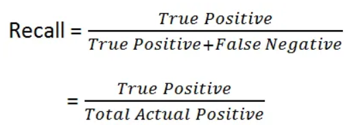

## Supervised Learning
Supervised learning we train a machine learning model using labeled data, where each data point has a known output or label that model tries to predict. The goal of supervised learning is to create a model that can accurately predict the output for new, unseen data.
There are two broad categories in Supervised machine learning.
  - Classification
  - Regression

### Classification
Classification involves predicting a categorical label or class for a given input. Classification usea a binary (true-positive/true-negative) approach to predict membership in a category(i.e, will the outcome be of type A or type B). For example, a classification model could be trained to classify emails as spam or not spam based on the text content of the email. Other examples of classification tasks include image classification, sentiment analysis, and fraud detection.

### Regression
Regression involves predicting a continuous numerical value for a given input. For example, a repression model could be trained to predict the price of a house based on its size, location, and other relevant features. Other examples of regression tasks include stock price prediction, weather forecasting, and demand forecasting.

The quality of the model's predictions is measured using various metrics such as accuracy, precision, recall and F1.

### Resampling
Resampling stategies can be used to adjust the balance of the imbalanced dataset and improve model performance.

The two manin resampling stragies are:
  - Oversampling
  - Undersampling

Oversampling: it involves adding more instances of minority class to the dataset. This can be done using techniques such as random oversampling, where instances of the minority calss are duplicated. 

Undersampling: it involves removing instances of the majority class to balance the dataset. This can be done using techniques such as random undersampling, where instances of the majority class are removed at random, or informed undersampling, where instances are removed based on their similarity to instances of the minority class.

Both oversampling and undersampling have their pros and cons. Oversampling can lead to overfitting and may not be effective if the minority calss is inherently different from the majority class. Undersampling may lead to loss of important information and may not be effective if the dataset is too small.

Imbalanced dataset:in this dataset the classes are not represented equally, that means the number of observations in one class is significantly higher or lower than the number of observations in the other classes.

## Overview of the Analysis

The objective of this study is to construct a model that can categorize borrower's creditworthiness into two distinct groups, using various techniques to train and evaluate the model. The dataset utilized is derived from the lending history of a peer-to-peer lending service company.

Borrowers: 
  - Healthy Loans
  - High-risk Loans

Datasets: 
  - Original dataset
  - Oversampled dataset

## Steps
  - We read the file into Pandas DataFrame.
  - Created the labels set (`y`) from the "loan_status" column, and then the features(`X`) DataFrame from the remaining columns.
  - splited the data into training and testing datasets by using `train_test_split`.

Initially, we created a Logistic Regression model using the original dataset, by using `value_counts()` of (`y`),which contains 75036 records with a `loan_status` of healthy and 2500 records with a high risk of defaulting. We evaluated the model's performance using accuracy score, confussion matrix and classification report.

Next, we used the `RandomOverSampler` module from the `imbalanced-learn` library to resample the original data and genereate two equal sets of 56277 records each, representing healthy and high-rish loans. We then rerun the Logistic Regression model on the resampled data and evaluate its performance using the same metrics as before.

## Results

### Model1: 
  - It is very important to measure the balance accuracy score of the model, particularly when the classes are imbalanced.  
  Balaced Accuracy Score: 0.9442676901753825

  - According to the confusion matrix, the model accurately predicted 18678 loans as "healthy" and 558 loans as "high-risk".

  - The classification report is often used in machine learning to compute the accuracy of a classification model based on the values from the confusion matrix.

    - Accuracy: Accuracy is a measure of how often the model is correct - the ratio of correctly predicted observations to the total number of observations. In addition to accuracy, we also have to measure precision and recall, both of which can be used to eliminate false positives and false negatives. Accuracy, precision, and recall are especially important for classification models that involve a binary decision problem. Binary decision problems have two possible correct answers: True Positive and True Negative. Inaccurate and imprecise models will return false positives and false negatives.
     
      Accuracy = Number of Correct Predictions/ Total Number of predictions

    - Precision: Precision is the ratio of correctly predicted observations to the total predicted positive observations. The presicion tells us the accuracy of positive predictions. A high precision score is crucial for reducing false positives, which could result in a loss of potential customers. 

      

    - Recall: Recall is the ratio of correctly predicted positive observations to all predicted observations for that class. 

      

      So Recall actually calculates how many of the Actual Positives our model are captured as True Positive. A high recall score is essential for minimizing false negatives. For example, in fraud detection, if a fraudulent transaction (Actual Positive) is predicted as non-fraudulent (Predicted Negative), the result can be very bad for the bank.
                  
    - Classification Report: Classification report holds the test results so we can identify the precision, recall, and accuracy of a model for each given class. 
    Based on this classification report of our model below, the model achieved high accuracy(99%). When predicting healthy loans, recall produced the best overall predictive outcome, with the highest true positive rate for healthy loans and true negative rate for high-risk loans. However, this result is misleadig because our data set is imbalanced. Our model is biased towards the majority of the observation class and may not perform well on the class which is having the less number of observaitons. Resampling the data to create a more balanced dataset may provide higher precision.

    The classification report:

    

  

### Model2:

By oversampling our data, this model increases the balanced accuracy score nearly to 100%. 

  Balanced Accuracy Score: 0.9959744975744975

Based on the classification report we see the model leading to a 100% accuracy, which means that it performed very well in distinguishing between healthy loans and high-risk loans. The model achieved the highest true positive (healthy loans) and true negative (high-risk loans) for healthy loans. 

  The classification report:

  

## Summary

By oversampling our original data, our Logistic Regression model showed improvements resulting in higher precision and perfect recall. The resampled data improved the Logistic Regression model with a high accuracy score of 100% and a high balanced accuracy score as well. The Logistic Regression model with oversampled data (Model2) is therefore a better fit than the one (Model1) with imbalanced data.

